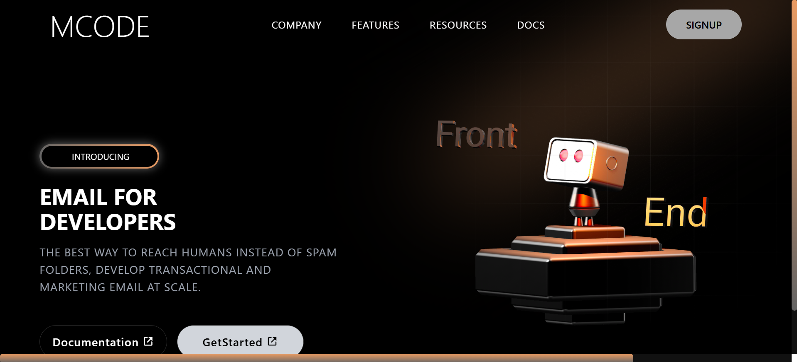

# DevEmailHub

React Landing Page for Developer Email Platform

---

## 🚀 Overview

DevEmailHub is a modern, responsive landing page built with **React** and **Tailwind CSS**.  
It is designed for developers to showcase email features and reach users effectively, avoiding spam folders.

---

## ✨ Features

- Responsive design (desktop + mobile)  
- Animated components using **AOS**  
- Interactive 3D visuals with **Spline**  
- Icon integration with **Boxicons**  
- Clean, modern UI  

---

## 📸 Screenshots



 

---

# 💻 Installation & Setup

## 1. Clone the repository:
```bash
git clone https://github.com/Asma449/DevEmailHub.git
```

## 🔗 Live Demo

[View Live Site](https://dev-email-hub-4dye.vercel.app/)